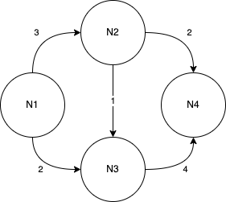

# dijkstra
simple impl of dijkstra pathfinder alg on jdk 17+

command line 
```bnf
<cmd> ::= <source_node_id> <target_node_id> <edge_triplet>*
<edge_triplet> ::= <from_noe_id> "," <to_node_id> "," <weight>
```

# build
```bash
./gradlew app:fatJar
```
# test
example graph



# run
```bash
java  -jar app/build/libs/app-all.jar N1 N4 N1,N2,3 N1,N3,2 N2,N3,1 N2,N4,2 N3,N4,4```
